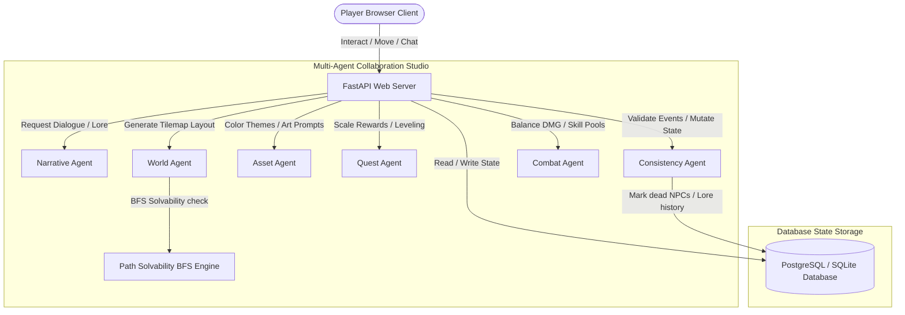

# VibeCode: Legends of Elyndor 🎮✨
### AI Multi-Agent RPG World Builder & Game Engine
**Submission Track:** Freestyle (Creative AI & Game Development)  
**Target:** Kaggle AI Agents: Intensive Vibe Coding Capstone Project

`VibeCode: Legends of Elyndor` is a high-fidelity, complete fantasy RPG where a team of **six collaborative AI Agents** dynamically design, generate, and maintain a persistent, evolving dark fantasy world. The game is fully playable by a user in the browser using **Vite + React + TypeScript + Tailwind + Zustand + Phaser 3** on the frontend, and a robust **FastAPI + SQLAlchemy + PostgreSQL (SQLite fallback)** backend.

---

## 📐 Multi-Agent System Architecture

The game's lifecycle is managed by six collaborative, specialized AI agents executing discrete tasks and maintaining absolute state consistency:



---

## 🤖 The 6 Core AI Agents & Responsibilities

| Agent Name | Primary Responsibility | Input Details | Generated Artifacts / Outputs |
| :--- | :--- | :--- | :--- |
| **1. Narrative Agent** | Writes historical lore, faction bios, NPC personas, and dynamic dialog bubbles. | User prompts & dialogue histories | Context-aware dialogue tree lines |
| **2. World Agent** | Shapes map grids, coordinates starting spots, chests, and dungeon crypt exits. | Regional theme properties | Rectangular ASCII tilemap strings |
| **3. Asset Agent** | Generates detailed image prompts & provides vector color codes for Phaser rendering. | Loot titles & regional tags | CSS hex palettes & sprite descriptors |
| **4. Quest Agent** | Generates dynamic quest lines and scales experience and gold rewards linearly with level. | Character Level & Region | Custom item loot tables & objective schemas |
| **5. Consistency Agent**| Mutates state to preserve world continuity (e.g. locks deceased NPCs, writes history logs).| Critical in-game events | Dynamic SQL state updates |
| **6. Combat Agent** | Scales enemy statistics and processes turn-by-turn physics (crit, miss, dodge, HP metrics).| Player stats & Attack choice | Combat result payloads |

---

## 🎨 Visual Design System: Dark Gothic

Inspired by **Diablo IV and Baldur's Gate 3**, the game implements:
* **Glassmorphism panels**: Deep translucent background gradients mixed with subtle golden board frames.
* **Cinematic Typography**: Uses *Cinzel* for headers and *Outfit* for modern legible stats.
* **Floating combat sparks**: Real-time particle explosions when chests are looted or ghouls are slayed inside the Phaser engine canvas.

---

## 🛠️ Tech Stack & Setup Details

### Frontend
* **Core framework**: React v18 + TypeScript + Vite
* **Game engine**: Phaser 3 (2D web-canvas game loop integration)
* **Global state manager**: Zustand (JWT tokens, HUD parameters, battle triggers, mock offsets)
* **Styling**: TailwindCSS + PostCSS

### Backend
* **Web framework**: FastAPI + Python 3.11
* **ORM / Database**: SQLAlchemy + SQLite (for local zero-config sandboxing) / PostgreSQL (for Docker)
* **Auth**: JWT Bearer Tokens with `passlib` bcrypt hashing

---

## 🚀 Deployment Instructions

### Prerequisites
1. Install [Docker](https://www.docker.com/) and [Docker Compose](https://docs.docker.com/compose/).
2. (Optional) Set your `GEMINI_API_KEY` env variable to hook up Google's Gemini LLM. If missing, the backend will auto-engage **highly-immersive local procedural synthesis engines** to keep the game 100% playable with zero configuration!

### Option 1: Quick Unified Launch (Docker Compose)
Inside the root project directory (`vibecode-elyndor/`), execute:
```bash
docker-compose up --build
```
Once built, open your web browser to:
* **Frontend Game Screen**: [http://localhost:3000](http://localhost:3000)
* **FastAPI Interactive Docs**: [http://localhost:8000/docs](http://localhost:8000/docs)

### Option 2: Running Locally Without Docker (Sandbox/Offline)
#### 1. Launch Backend:
```bash
cd backend
python -m venv .venv
source .venv/bin/activate
pip install -r requirements.txt
uvicorn app.main:app --reload --port 8000
```
#### 2. Launch Frontend:
```bash
cd ../frontend
npm install
npm run dev
```
Open [http://localhost:3000](http://localhost:3000) in your browser. The system will automatically detect the local API server. If the server is offline, it auto-seeds **sandbox playbacks** allowing seamless play instantly!

---

## 🔒 Security Features
1. **JWT Auth Access Tokens**: Enforces strict sub-claims, token expirations, and secure hashing.
2. **Deterministic Inputs**: Validates coordinates and actions to block server-side code injections.
3. **No Trailing Traversal**: Restricts level loading variables to validated pre-seeded schemas.
